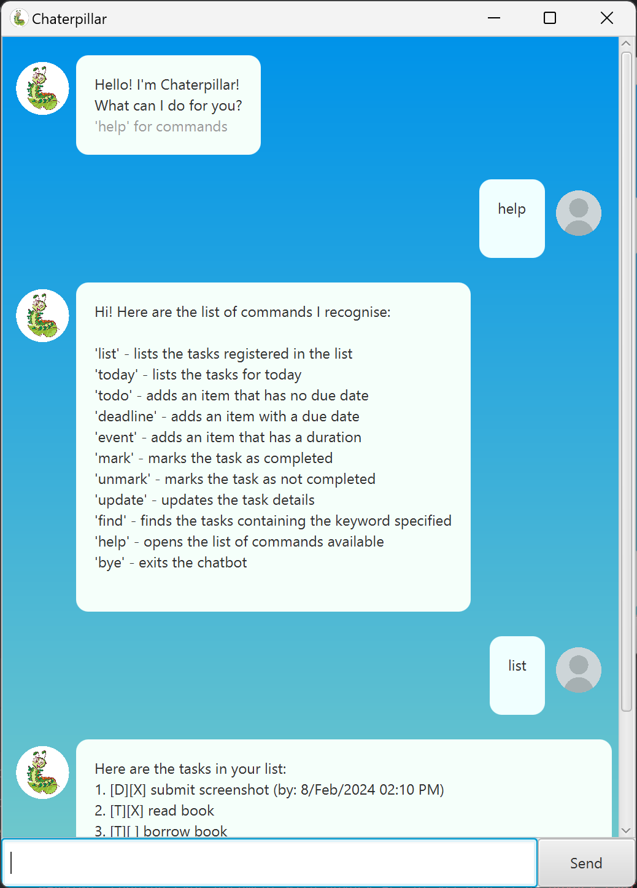

# Chaterpillar User Guide


Chaterpillar is a friendly chatbot-style assistance application. 
Chat with it, and it will help you track the different tasks you have on hand. :D

--------------------------------------------------------------------------------------------------------------------
## Features
### Adding To-Do Tasks

Adds a task to be done, with no specific duration or deadline, into your list of tasks.

Format: `todo {task name}`\
Example: `todo update README doc`

Chaterpillar will let you know if the task is successfully added :)

```
Got it. I've added this task:
[T][ ] update README doc
Now you have 1 task(s) in the list.
```

### Adding Deadlines

Adds a task with a specific deadline, into your list of tasks.

Format: `deadline {task name} /by {due date [and time]}`
* Time is optional, default value of 00:00 AM will be assigned but not shown.
* Date/Time can be entered in a variety of common inputs, e.g. `4 Feb`, `04/02`, 
`04/02/2024`, `4 Feb 6 PM`, `4/Feb/2024 1600`, ...

Examples: 
* `deadline submit final report /by 25 Feb 9 PM`
* `deadline finish task /by 25/02/2024 2100`

Chaterpillar will let you know if the task is successfully added :)

```
Got it. I've added this task:
[D][ ] submit final report (by: 25/Feb/2024 09:00 PM)
Now you have 2 task(s) in the list.
```

### Adding Events

Adds a task with a specific duration, into your list of tasks.

Format: `event {task name} /from {start date} /to {end date}`
* Time is optional, default value of 00:00 AM will be assigned but not shown.
* Date/Time can be entered in a variety of common inputs, e.g. `4 Feb`, `04/02`,
  `04/02/2024`, `4 Feb 6 PM`, `4/Feb/2024 1600`, ...

Example: `event CCA training /from 20 Feb 5 PM /to 20 Feb 7 PM`

Chaterpillar will let you know if the task is successfully added :)

```
Got it. I've added this task:
[E][ ] CCA training (from: 20/Feb/2024 05:00 PM to: 20/Feb/2024 07:00 PM)
Now you have 3 task(s) in the list.
```

### Listing All Tasks

Lists all the tasks you have in your list currently.

Format: `list`

```
Here are the tasks in your list:
1. [T][ ] update README doc
2. [D][ ] submit final report (by: 25/Feb/2024 09:00 PM)
3. [E][ ] CCA training (from: 20/Feb/2024 05:00 PM to: 20/Feb/2024 07:00 PM)
```

### Getting the Tasks for Today

Lists all the task you have today.

Format: `today`

```
For 20/Feb/2024,
Here are the tasks in your list:
1. [E][ ] CCA training (from: 20/Feb/2024 05:00 PM to: 20/Feb/2024 07:00 PM)
```

### Finding a Task with a Specific Keyword

Chaterpillar will find a task that matches or contains the
keyword provided.
* Only the name is searched.
* Fuzzy matching, e.g. `make booking` will be matched with `book`

Format: `find {keyword}`

Example: `find doc`

Chaterpillar will list all the tasks that matches the keyword provided.

```
Here are the items that match the keyword (doc):
Here are the tasks in your list:
1. [T][ ] update README doc
```

### Marking and Unmarking a Task

Chaterpillar will help you mark or unmark a task as done or undone respectively.

Format: 
* `mark {index}`
* `unmark {index}`

Example: 
* `mark 1`
* `unmark 2`


Chaterpillar will let you know if the task is successfully marked/unmarked :)

```
Nice! I 've marked this task as done:
[T][X] update README doc
```
```
Ok, I've marked this task as not done yet:
[D][ ] submit final report (by: 25/Feb/2024 09:00 PM)
```

### Updating a Task's Details

Chaterpillar can help you update a task's details

Format: `update {index} [/name {new name}] [/date {new date}] 
        [/start {new start date}] [/end {new end date}]`
* Updates the task at the specified `index`. The index refers to the 
index number displayed in the full task list. The index **must be a 
positive index** and within the number of tasks, i.e. 1, 2, 3...
* At least one of the optional fields must be provided.
* Existing values will be updated to the input values.

Example: 
* `update 2 /name submit report /date 21 Feb`
* `update 3 /start 22/02 1600`

_The task details have to correspond with the type of task being updated,
otherwise it Chaterpillar will not be able to help you._

Chaterpillar will let you know if the task is successfully updated :)

```
Okay! I have updated the following task:
2. [D][ ] submit report (by: 21/Feb/2024)
```

### Help 

Chaterpillar will provide you a list of commands it accepts.

Format: `help`

--------------------------------------------------------------------------------------------------------------------

## Command summary

| Action                | Format, Examples                                                                                                                                             |
|-----------------------|--------------------------------------------------------------------------------------------------------------------------------------------------------------|
| **Add To-Do Task**    | `todo {task name}` `todo update README doc`                                                                                                                  |
| **Add Deadline Task** | `deadline {task name} /by {due date [and time]}` <br> e.g. `deadline submit final report /by 25 Feb 9 PM`                                                    |
| **Add Event Task**    | `event {task name} /from {start date} /to {end date}` <br> e.g. `event CCA training /from 20 Feb 5 PM /to 20 Feb 7 PM`                                       |
| **Mark**              | `mark {index}` e.g., `mark 1`                                                                                                                                |
| **Unmark**            | `unmark {index}` e.g. `unmark 2`                                                                                                                             |
| **Update**            | `update {index} [/name {new name}] [/date {new date}] [/start {new start date}] [/end {new end date}]` <br> e.g. `update 2 /name submit report /date 21 Feb` |
| **List**              | `list`                                                                                                                                                       |
| **Find**              | `find {keyword}` e.g., `find book`                                                                                                                           |
| **Help**              | `help`                                                                                                                                                       |
